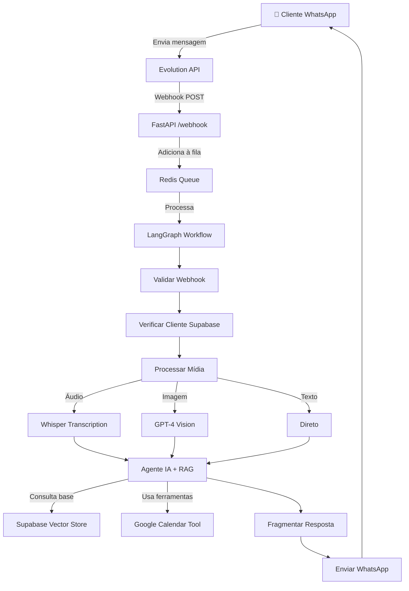

# 📊 RESUMO COMPLETO DO PROJETO - WhatsApp Bot Multi-Tenant com LangGraph

## 🎯 Visão Geral

Este projeto é um **sistema completo de atendimento automatizado via WhatsApp** utilizando **LangGraph** para orquestração de fluxos conversacionais inteligentes. O sistema está **atualmente em produção** e funcionando 100%.

**Status Atual:** ✅ **PRODUÇÃO ATIVA**

- **URL:** https://botdev.automacaovn.shop
- **Servidor:** Hetzner Cloud (IP: 46.62.155.254)
- **Deployment:** Docker Swarm + Traefik + Let's Encrypt

---

## 📁 Estrutura do Projeto Atual

```
Langcham-fluxo-atendimento/
├── 📂 src/                          # Código-fonte principal
│   ├── 📂 config/                   # ✅ Configurações
│   │   └── settings.py              # Pydantic Settings com validação
│   │
│   ├── 📂 models/                   # ✅ Modelos e Estados
│   │   └── state.py                 # AgentState TypedDict + Enums
│   │
│   ├── 📂 clients/                  # ✅ Integrações Externas
│   │   ├── supabase_client.py       # Cliente Supabase + RAG
│   │   ├── redis_client.py          # Gerenciador de fila
│   │   └── whatsapp_client.py       # Evolution API Client
│   │
│   ├── 📂 nodes/                    # ✅ Nós do LangGraph
│   │   ├── webhook.py               # Recepção e validação de webhooks
│   │   ├── media.py                 # Processamento de áudio/imagem
│   │   ├── agent.py                 # Agente IA com RAG
│   │   └── response.py              # Fragmentação e envio
│   │
│   ├── 📂 tools/                    # ✅ Ferramentas do Agente
│   │   ├── scheduling.py            # Google Calendar API
│   │   └── contact_tech.py          # Notificação de técnicos
│   │
│   ├── 📂 graph/                    # ✅ Workflow LangGraph
│   │   └── workflow.py              # Definição completa do grafo
│   │
│   ├── 📂 history/                  # ✅ Memória de Conversas
│   │   └── supabase_history.py      # PostgreSQL History Store
│   │
│   └── main.py                      # ✅ FastAPI Application
│
├── 📂 tests/                        # ✅ Testes
│   └── conftest.py                  # Fixtures compartilhadas
│
├── 📂 .github/workflows/            # ✅ CI/CD
│   └── deploy.yml                   # GitHub Actions Deploy
│
├── 📄 requirements.txt              # ✅ Dependências Python
├── 📄 Dockerfile                    # ✅ Container Docker
├── 📄 docker-compose.yml            # ✅ Configuração local
├── 📄 .env.production               # ✅ Variáveis de produção
└── 📄 README.md                     # ✅ Documentação principal
```

---

## 🚀 Funcionalidades Implementadas

### ✅ 1. **Sistema de Webhook WhatsApp**

- Recepção de mensagens via Evolution API
- Validação de payload
- Identificação automática de clientes
- Cadastro automático de novos usuários no Supabase

### ✅ 2. **Processamento Multi-Mídia**

- **📝 Texto:** Processamento direto
- **🎵 Áudio:** Transcrição automática com OpenAI Whisper
- **🖼️ Imagem:** Análise visual com GPT-4 Vision
- **📹 Vídeo:** Suporte básico para vídeos
- **📄 Documentos:** Processamento de anexos

### ✅ 3. **Agente Inteligente LangGraph**

- Workflow orquestrado com estados
- 10 nós diferentes no grafo:
  1. `validar_webhook` - Validação de entrada
  2. `verificar_cliente` - Busca no Supabase
  3. `cadastrar_cliente` - Novo registro
  4. `processar_midia` - Router de tipo
  5. `processar_audio` - Whisper transcription
  6. `processar_imagem` - GPT-4 Vision
  7. `processar_texto` - Direto
  8. `processar_agente` - IA + RAG + Tools
  9. `fragmentar_resposta` - Split em mensagens
  10. `enviar_respostas` - WhatsApp API

### ✅ 4. **RAG (Retrieval-Augmented Generation)**

- Base de conhecimento vetorizada no Supabase
- Embeddings com OpenAI `text-embedding-3-small`
- Busca semântica por similaridade de cosseno
- Contexto enriquecido para respostas precisas

### ✅ 5. **Sistema de Agendamento Google Calendar**

- Consultar horários disponíveis
- Agendar consultas automaticamente
- Cancelar e reagendar compromissos
- Notificação automática para técnicos via WhatsApp
- Validação de números de telefone

### ✅ 6. **Gestão de Conversas**

- Memória persistente no PostgreSQL via Supabase
- Histórico completo de interações
- Contexto mantido entre sessões
- Agrupamento inteligente de mensagens (delay de 13s)

### ✅ 7. **Sistema de Fila Redis**

- Controle de concorrência
- Processamento sequencial por cliente
- Prevent race conditions
- Background tasks para não bloquear responses

### ✅ 8. **API REST Completa**

- FastAPI com documentação automática (Swagger/ReDoc)
- Endpoint `/webhook` para Evolution API
- Endpoint `/health` para monitoramento
- Endpoint `/test/message` para testes
- Logs estruturados com Loguru

### ✅ 9. **Deploy em Produção**

- Docker Swarm no Hetzner Cloud
- Traefik para proxy reverso + SSL automático
- Let's Encrypt para certificados HTTPS
- Portainer para gerenciamento visual
- Zero downtime deployment

### ✅ 10. **Monitoramento e Logging**

- Health checks automáticos
- Logs detalhados com níveis (DEBUG, INFO, WARNING, ERROR)
- Tracking de erros e exceptions
- Métricas de performance

---

## 🛠️ Stack Tecnológica

### **Core Framework**

- **LangGraph 1.0.1** - Orquestração de workflows com estados
- **LangChain 1.0.2** - Framework para LLM
- **FastAPI 0.120.2** - API web assíncrona
- **Python 3.13.9** - Linguagem principal

### **Inteligência Artificial**

- **OpenAI GPT-4o** - Modelo de linguagem principal
- **OpenAI Whisper** - Transcrição de áudio
- **OpenAI GPT-4 Vision** - Análise de imagens
- **OpenAI Embeddings** - Vetorização para RAG

### **Banco de Dados & Cache**

- **Supabase PostgreSQL** - Banco principal + Vector Store
- **Redis 7.0.1** - Cache e sistema de filas
- **pgvector** - Extensão para busca vetorial

### **Integrações**

- **Evolution API** - WhatsApp Business API
- **Google Calendar API** - Sistema de agendamento
- **Supabase Storage** - Armazenamento de mídias

### **DevOps**

- **Docker** - Containerização
- **Docker Swarm** - Orquestração
- **Traefik** - Proxy reverso + SSL
- **GitHub Actions** - CI/CD
- **Portainer** - Gerenciamento visual

---

## 📊 Arquitetura do Sistema

### **Fluxo de Processamento de Mensagem**



### **Infraestrutura de Produção**

```
┌─────────────────────────────────────────────┐
│        HETZNER CLOUD SERVER                  │
│         46.62.155.254                        │
├─────────────────────────────────────────────┤
│                                              │
│  ┌────────────────────────────────────┐    │
│  │  Traefik (Porta 80/443)             │    │
│  │  - SSL/TLS Let's Encrypt            │    │
│  │  - bot.automacaovn.shop             │    │
│  └────────────────────────────────────┘    │
│              ↓                               │
│  ┌────────────────────────────────────┐    │
│  │  WhatsApp Bot (Porta 8000)          │    │
│  │  - FastAPI + LangGraph              │    │
│  │  - OpenAI GPT-4o                    │    │
│  │  - Supabase Client                  │    │
│  └────────────────────────────────────┘    │
│              ↓         ↓                     │
│  ┌──────────┐    ┌──────────────┐          │
│  │  Redis   │    │  Evolution   │          │
│  │  Cache   │    │  WhatsApp    │          │
│  └──────────┘    └──────────────┘          │
│                                              │
└─────────────────────────────────────────────┘
         ↓                    ↓
   ┌──────────┐      ┌──────────────┐
   │ Supabase │      │ Google       │
   │ Cloud    │      │ Calendar API │
   └──────────┘      └──────────────┘
```

---

## 🎯 O QUE VAMOS MELHORAR - PLANO MULTI-TENANT

### 🚧 **FASE 1: Transformação Multi-Tenant**

#### **Objetivo:** Permitir múltiplos clientes/empresas usando a mesma infraestrutura

#### **Mudanças Necessárias:**

1. **🗄️ Banco de Dados - Nova Estrutura**

   ```sql
   -- Nova tabela de tenants (empresas/clientes)
   CREATE TABLE tenants (
       id UUID PRIMARY KEY,
       nome TEXT NOT NULL,
       slug TEXT UNIQUE NOT NULL,  -- ex: "drywall-centro-oeste"
       whatsapp_instance TEXT,      -- Instância Evolution API
       openai_api_key TEXT,         -- API Key própria (opcional)
       calendario_id TEXT,          -- Google Calendar específico
       config JSONB,                -- Configurações customizadas
       ativo BOOLEAN DEFAULT true,
       criado_em TIMESTAMP DEFAULT NOW()
   );

   -- Modificar tabela de clientes
   ALTER TABLE clients ADD COLUMN tenant_id UUID REFERENCES tenants(id);

   -- Modificar tabela de conversas
   ALTER TABLE conversation_history ADD COLUMN tenant_id UUID REFERENCES tenants(id);

   -- Nova tabela de base de conhecimento por tenant
   CREATE TABLE knowledge_base (
       id UUID PRIMARY KEY,
       tenant_id UUID REFERENCES tenants(id),
       conteudo TEXT,
       embedding VECTOR(1536),
       metadata JSONB,
       criado_em TIMESTAMP DEFAULT NOW()
   );
   ```

2. **🔧 Configurações por Tenant**

   - Cada tenant terá suas próprias configurações
   - API Keys separadas (OpenAI, Google Calendar)
   - Base de conhecimento isolada
   - Instância WhatsApp dedicada

3. **🔐 Sistema de Autenticação**

   - Identificar tenant pelo número WhatsApp ou instância
   - Middleware FastAPI para injetar tenant_id
   - Isolamento completo de dados entre tenants

4. **📚 RAG Multi-Tenant**

   - Base de conhecimento separada por tenant
   - Embeddings isolados
   - Busca vetorial filtrada por tenant_id

5. **🎨 Personalização por Tenant**
   - Prompts customizados
   - Horários de atendimento específicos
   - Mensagens de boas-vindas personalizadas
   - Tools habilitadas/desabilitadas por tenant

---

### 🚧 **FASE 2: Interface de Administração**

#### **Objetivo:** Dashboard web para gerenciar tenants

#### **Funcionalidades:**

1. **📊 Dashboard Principal**

   - Listagem de todos os tenants
   - Métricas por tenant:
     - Total de conversas
     - Mensagens processadas
     - Agendamentos realizados
     - Taxa de sucesso

2. **➕ Gestão de Tenants**

   - Criar novo tenant
   - Editar configurações
   - Ativar/desativar tenant
   - Deletar tenant (soft delete)

3. **📚 Gestão de Base de Conhecimento**

   - Upload de documentos por tenant
   - Gerar embeddings automaticamente
   - Testar busca semântica
   - Ver estatísticas de uso

4. **📅 Gestão de Agendamentos**

   - Ver calendários por tenant
   - Configurar horários disponíveis
   - Integrar múltiplos calendários

5. **📈 Analytics**
   - Gráficos de uso por tenant
   - Relatórios de conversas
   - Export de dados (CSV, JSON)

**Stack Sugerida:**

- **Frontend:** Next.js + React + TailwindCSS
- **Backend:** FastAPI (mesma base)
- **Auth:** Supabase Auth
- **Charts:** Recharts ou Chart.js

---

### 🚧 **FASE 3: API de Gestão**

#### **Objetivo:** API RESTful para gerenciar tenants programaticamente

#### **Endpoints:**

```python
# Tenants
POST   /api/v1/tenants              # Criar tenant
GET    /api/v1/tenants              # Listar tenants
GET    /api/v1/tenants/{id}         # Buscar tenant
PUT    /api/v1/tenants/{id}         # Atualizar tenant
DELETE /api/v1/tenants/{id}         # Deletar tenant

# Knowledge Base
POST   /api/v1/tenants/{id}/knowledge        # Upload documento
GET    /api/v1/tenants/{id}/knowledge        # Listar documentos
DELETE /api/v1/tenants/{id}/knowledge/{doc}  # Deletar documento

# Configurações
GET    /api/v1/tenants/{id}/config   # Buscar config
PUT    /api/v1/tenants/{id}/config   # Atualizar config

# Métricas
GET    /api/v1/tenants/{id}/metrics  # Estatísticas do tenant
GET    /api/v1/tenants/{id}/conversations  # Histórico
```

---

### 🚧 **FASE 4: Melhorias de Escalabilidade**

#### **Objetivo:** Preparar sistema para centenas de tenants

#### **Otimizações:**

1. **⚡ Cache Avançado**

   - Redis para cache de configurações por tenant
   - Cache de embeddings frequentes
   - Rate limiting por tenant

2. **📊 Database Pooling**

   - Connection pooling otimizado
   - Queries otimizadas com índices
   - Particionamento de tabelas grandes

3. **🔄 Background Jobs**

   - Celery para tarefas assíncronas
   - Geração de embeddings em background
   - Limpeza automática de dados antigos

4. **📈 Monitoramento**
   - Prometheus + Grafana
   - Alertas por tenant
   - Tracking de custos OpenAI por tenant

---

### 🚧 **FASE 5: Recursos Avançados**

#### **Objetivo:** Funcionalidades premium

1. **🤖 IA Personalizada**

   - Fine-tuning de modelos por tenant
   - Análise de sentimento
   - Detecção de intenções customizada

2. **📞 Integrações Extras**

   - CRM (HubSpot, Salesforce)
   - E-commerce (Shopify, WooCommerce)
   - Notificações SMS
   - Email marketing

3. **📊 Reports Avançados**

   - BI dashboard
   - Análise de conversas com NLP
   - Recomendações automáticas

4. **🌐 Multi-idioma**
   - Detecção automática de idioma
   - Tradução em tempo real
   - Base de conhecimento multilíngue

---

## 📝 Plano de Implementação

### **Timeline Sugerido:**

| Fase       | Descrição              | Tempo Estimado | Prioridade |
| ---------- | ---------------------- | -------------- | ---------- |
| **Fase 1** | Estrutura Multi-Tenant | 2-3 dias       | 🔴 Alta    |
| **Fase 2** | Dashboard Admin        | 3-4 dias       | 🟡 Média   |
| **Fase 3** | API de Gestão          | 1-2 dias       | 🟡 Média   |
| **Fase 4** | Escalabilidade         | 2-3 dias       | 🟢 Baixa   |
| **Fase 5** | Recursos Avançados     | 4-5 dias       | 🟢 Baixa   |

**Total:** ~12-17 dias de desenvolvimento

---

## 💡 Benefícios do Multi-Tenant

### **Para o Negócio:**

- 💰 **Monetização:** SaaS com múltiplos clientes
- 📈 **Escalabilidade:** Crescimento sem limites
- 🔧 **Manutenção:** Uma única codebase
- 💵 **Custos:** Infraestrutura compartilhada

### **Para os Clientes:**

- 🎨 **Personalização:** Experiência única
- 📊 **Analytics:** Dados isolados e seguros
- 🔐 **Segurança:** Isolamento de dados
- ⚡ **Performance:** Otimização por uso

---

## 🚀 Próximos Passos Imediatos

### **1. Validação do Projeto Atual**

- [ ] Revisar código existente
- [ ] Documentar APIs atuais
- [ ] Mapear dependências
- [ ] Identificar pontos de melhoria

### **2. Planejamento Multi-Tenant**

- [ ] Definir modelo de dados
- [ ] Criar migrations Supabase
- [ ] Prototipar isolamento de dados
- [ ] Testar performance com múltiplos tenants

### **3. Desenvolvimento Fase 1**

- [ ] Implementar tabela de tenants
- [ ] Modificar clientes para multi-tenant
- [ ] Atualizar RAG com filtro por tenant
- [ ] Criar middleware de identificação

### **4. Testes**

- [ ] Testes unitários para multi-tenant
- [ ] Testes de integração
- [ ] Testes de carga
- [ ] Validação de isolamento

---

## 📚 Documentação Adicional

### **Arquivos de Referência:**

- `README.md` - Documentação principal do projeto
- `STRUCTURE.md` - Estrutura detalhada
- `FASE_0_COMPLETO.md` - Histórico de implementação
- `QUICK_DEPLOY_GITHUB.md` - Guia de deploy
- `AGENT_DOCUMENTATION.md` - Documentação do agente

### **Diagramas Disponíveis:**

- `workflow_diagram.mmd` - Fluxo Mermaid do workflow
- `workflow_diagram.html` - Visualização interativa

---

## ✅ Checklist de Sucesso Multi-Tenant

### **MVP Multi-Tenant:**

- [ ] Tabela de tenants criada
- [ ] Isolamento de dados funcionando
- [ ] RAG separado por tenant
- [ ] Configurações personalizadas
- [ ] 2-3 tenants de teste rodando
- [ ] Dashboard básico funcionando

### **Produção Multi-Tenant:**

- [ ] Testes completos
- [ ] Documentação atualizada
- [ ] Monitoramento configurado
- [ ] Backup automatizado
- [ ] CI/CD adaptado
- [ ] Suporte a 10+ tenants

---

## 🎯 Conclusão

Este projeto já possui uma base sólida e funcional em produção. A transformação para multi-tenant é o próximo passo natural para escalar o negócio e oferecer o sistema como SaaS.

**Pontos Fortes Atuais:**
✅ Arquitetura limpa e modular
✅ LangGraph bem estruturado
✅ Integrações funcionando
✅ Deploy automatizado
✅ Código documentado

**Oportunidades de Melhoria:**
🚀 Multi-tenancy
🚀 Dashboard de administração
🚀 API de gestão
🚀 Escalabilidade avançada
🚀 Recursos premium

---

**Desenvolvido por:** Vinícius Soutenio
**Data:** Outubro 2025
**Status:** Em Produção - Planejando Multi-Tenant
**Versão:** 1.0.0 (Single-Tenant) → 2.0.0 (Multi-Tenant)
